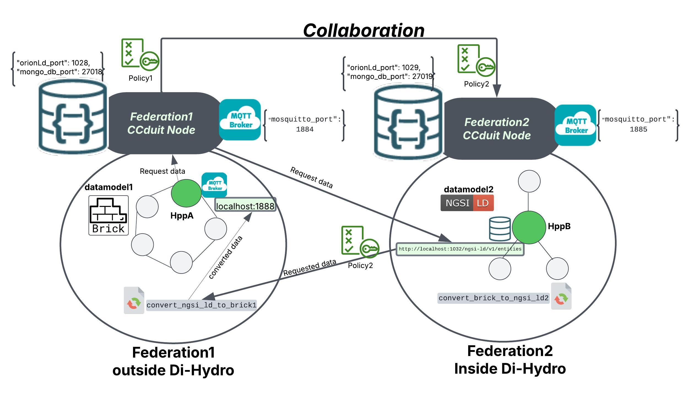

# CCduit Software Overlay Prototype

##  **Overview**  

**CCDUIT** is a software overlay designed to enable semantically interoperable data exchange between heterogeneous federated data spaces. It supports structured collaboration among independently managed environments, enforcing data-sharing policies, aligning semantic models, and bridging protocol differences

This module forms part of the Di-Hydro Deliverable D2.2 codebase, contributing to secure, policy-compliant cross federation-wide communication by abstracting away local heterogeneity. It enables two or more federations to interoperate while maintaining semantic clarity, contextual synchronization, and governance autonomy.

###  Key Features  
✔ **Policy Compliance:**  
   - Automatically enforces each federation’s rules, ensuring adherence to **agreed-upon policies**.  

✔ **Seamless Data Exchange:**  
   - Bridges the gap between **heterogeneous data models and protocols**, simplifying integration.  

✔ **Scalability:**  
   - Supports **new federations and evolving requirements** without extensive reconfiguration.  

>[!NOTE]
> For more details you can visit the official latest CCDUIT [wiki page](https://github.com/satrai-lab/ccduit/wiki)


---

## How it Works
The CCDUIT platform operates as a federation of CCDUIT nodes, each consisting of the following core components: 

### 1️⃣ **Administration API**  
The **Administration API** is responsible for **managing the CCDUIT node**.  
It serves as the **backbone for administrators**, providing essential tools to maintain system integrity and efficiency.  

🔹 **Key functionalities include:**  
* Initiation of Federation Collaborations
* System Configuration
* Policy Management
* Node Health Monitoring 
* User & Access Management
* System Updates & Maintenance


### 2️⃣ **Interaction API**  
The **Interaction API** is the **primary interface** for external entities to engage with the CCDUIT node.  
It acts as the **central gateway** for managing interactions such as **data requests and context entity manipulations**.  

#### 🔧 **Core Functionalities:**  
1. **_Management of Context Entities:_**  
   - Users can **define, modify, and expand** the knowledge base with new entities.  

2. **_Querying Context Entities:_**  
   - Enables retrieval of **specific information** for better decision-making and efficient data management.  

3. **_Lifecycle of Interactions:_**  
   - **Initiates data exchanges, triggers processes, and enables real-time tracking** of ongoing interactions.  

### 3️⃣ **Interaction Engine**  
The **Interaction Engine** is responsible for ensuring **data interoperability across federations**.  

📌 **Key Modules:**  
   **Data Transformation Module:**  
   - Adapts **data models** for seamless integration using **custom functions**.  

   **Interaction Strategy Coordinator Module:**  
   - Identifies **optimal data exchange pathways** based on **context, policies, and specifications**.  

   **Protocol Translator Module:**  
   - Aligns **different data exchange protocols**, ensuring **cross-federation compatibility**.  


### 4️⃣ **Knowledge Base (KB)**  
The **Knowledge Base (KB)** serves as a **repository** for storing information **crucial for interactions** among federations.  

#### 📂 **What It Stores:**  
   **Federation Information:**  
   - Profiles of each **federation, structure, and operational principles**.  

   **Community Context:**  
   - Details about **individual communities** within federations.  

   **Data Models:**  
   - Specifications of **data models used by different federations** to ensure compatibility.  

   **Custom Functions:**  
   - Specialized functions for **custom data processing**, improving **efficiency and reusability**.  

   **Policies:**  
   - Documentation of **data-sharing policies**, ensuring **legal and ethical compliance**.  

   **Interaction Context:**  
   - Records of **ongoing and past interactions**, offering **insights for decision-making**.  

 **How It Works:**  
The **KB** uses a **labeled property graph format** to represent **complex relationships** within federations.  
For example, a **“Federation” node** with properties such as **name and topology** can be linked to a **“Community” node** via an **“IncludesCommunity” edge**, depicting their association.  

**This is important because it**  
   * Accurately represents federation-community relationships
   * Enables fast and efficient querying of interactions 
   * Scales with growing data volumes

### 5️⃣ **Synergy Engine**  
The **Synergy Engine** ensures that federations operate **with synchronized policies and data**.  

#### 🔄 **Key Modules:**  
   **Policy Management Module:**  
   - **Enforces data-sharing policies**, ensuring **compliance across federations**.  

   **Context Synchronization Module:**  
   - **Keeps federations updated in real time**, reflecting any **context changes** immediately.  

This approach **ensures all federations operate with the latest policies and synchronized data**, maintaining **data integrity** and **policy alignment**.

**Using the CCDUIT software, two federations of hydropower plants collaborate, enabling their respective communities to exchange data seamlessly.**


---

## Prerequisites

- **Operating System:**  
  - Tested on **Windows 11** and **Ubuntu 22.04.4 LTS**.  
  - The instructions should work on any system supporting Python and Docker.

Ensure the following are installed on your system:

- **Python 3:**  
  Verify the installation by running:

  ```bash
  python3 --version
  ```

- **Docker Engine:**  
  Install Docker Desktop for Windows or Docker Engine for Linux.  
  Ensure Docker is running:

  ```bash
  docker --version
  ```
## CCDUIT: HPP Use Case Example 

Assume two hydropower plants (HPPs) need to share operational data—such as turbine vibration spectra, bearing temperatures, and guide-vane pressures— to train their Model for predective maintenance. one is outside Di-Hydro HPP_A where it represents its assets and measurements using the Brick data model and HTTP protocol, while the other within the Di-Hydro Federation HPP_B uses the NGSI-LD data model MQTT protocol. Here CCduit comes to the picture to achieve seamless data exchange. 

---

## How to Run

We will create CCDUIT node for each of the HPPs mentioned in the above use case.

### Installation and Configuration

#### Step 1: Download the Source Code

1. Download the provided source code archive.
2. Extract the archive into **separate directories**, each corresponding to one **'CCduit' node** for each federation described below.
   * **Federation1:** Represents a federation of HPPs out of Di-Hydro.
   * **Federation2:** Represents a federation of HPPs inside Di-Hydro.
> [!IMPORTANT] 
> **Extract each node from the original archive to avoid conflicts caused by duplication.**

4. Install the required packages:

   ```bash
   pip install -r requirements.txt
   ```

---

#### Step 2: Run the Application

1. **Open a terminal** in the directory of the **'CCduit' node** you wish to configure.

2. **Modify the `app.py` Port:**  
   Each federation node should run on a **unique port** to avoid conflicts.

   - Open the `app.py` file in a text editor.
   - Locate the line defining the port (e.g., `Api_port = 5000`).
   - Change the port number for each federation. For example:

     ```python
     Api_port = 5001  # Federation1 (inside Di-Hydro)
     Api_port = 5002  # Federation2 (outside Di-Hydro)
     ```

3. **Run the application for each federation:**

   ```bash
   python3 app.py
   ```

4. **Access the API documentation** in your browser by visiting:
    http://127.0.0.1:<Api_port>/docs


5. **Configure the software** via the API’s **Configuration** section to assign unique ports and names to each Docker container.

---

##### Example Configuration for Each Federation

**Federation 1** 

```json
{
"federation_name": "Federation1",
"orionLd_port": 1028,
"mongo_db_port": 27018,
"mosquitto_port": 1884
}
```

**Federation 2**

```json
{
"federation_name": "Federation2",
"orionLd_port": 1029,
"mongo_db_port": 27019,
"mosquitto_port": 1885
}
```
---

#### Step 3: Start the Containers

1. **Navigate to the `brokers` folder** of each federation:

   ```bash
   cd brokers
   ```

2. **Start the Docker containers**:

   ```bash
   docker-compose up
   ```

3. To run the containers in **detached mode** (background), use:

   ```bash
   docker-compose up -d
   ```

---

### Step 4: Run the Monitoring Services

1. Access the **Run Monitoring Services** section in the API documentation for each federation node.

2. **Execute the Run Monitoring** function to start monitoring services.

3. **Verify** that all monitoring processes are active and running as expected, you will see on the terminal two messages :
- Hello, Policy Synchronizer!
- Hello, collaboration monitoring!

---

### Step 5: Context Registration for Each Federation

Each federation node requires context registration to manage federations, communities, data models, and functions.

> [!NOTE]
> * The following instructions will create context for **two federations** with simplified configurations to facilitate understanding the data exchange between them later on.   
> * Make sure to **follow the exact order [Federation, Data Model, Community, Function etc.]** because there are bidirectional relationships created automatically by the system that assume that this order has been followed.

#### Federation 1

**Register Federation:**

```json
{
  "federation_Id": "Federation1",
  "name": "Federation1",
  "topology": "star",
  "structure": "hierarchy",
  "areaCovered": "5000m2",
  "number_Of_Nodes": 1,
  "includes_Communities": [],
  "uses_Interactions": []
}
```

**Register Data Model:**

```json
{
  "dataModel_Id": "datamodel1",
  "name": "Brick Ontology",
  "description": "A metadata schema",
  "format": "TTL",
  "specific_Ontology": "Brick",
  "ontology_Version": "1.3",
  "ontology_URL": "https://brickschema.org/ontology/1.3/Brick.ttl"
}
```

**Register Community:**

```json
{
  "community_Id": "HppA",
  "name": "HppA",
  "connection_Details": {
    "endpoint": "localhost:1888",
    "protocol": "MQTT"
  },
  "origin": "",
  "role_In_Federation": "a hydropower plant belong to the Federation1",
  "has_Data_Models": ["datamodel1"],
  "part_Of_Federation": "Federation1",
  "geographical_Location": ""
}
```

**Register Function:**

```json
{
  "function_Id": "convert_ngsi_ld_to_brick1",
  "call_Function": "convert_ngsi_ld_to_brick",
  "description": "Converts NGSI-LD data model to Brick.",
  "From_model": "NGSI-LD",
  "To_model": "Brick",
  "Version": "1.0",
  "usage_Guide": "Accepts JSON input, outputs TTL format.",
  "packages": ["rdflib", "datetime", "json"]
}
```

---

#### Federation 2

**Register Federation:**

```json
{
  "federation_Id": "Federation2",
  "name": "Federation2",
  "topology": "ring",
  "structure": "hierarchical",
  "areaCovered": "6000m2",
  "number_Of_Nodes": 1,
  "includes_Communities": [],
  "uses_Interactions": []
}
```

**Register Data Model:**

```json
{
  "dataModel_Id": "datamodel2",
  "name": "NGSI-LD",
  "description": "A metadata schema that facilitates semantic interoperability.",
  "format": "JSON",
  "specific_Ontology": "https://schema.org/temperature",
  "ontology_Version": "1.0",
  "ontology_URL": "https://schema.org/docs/temperature.html"
}
```

**Register Community:**

```json
{
  "community_Id": "Community2",
  "name": "Community2",
  "connection_Details": {
    "endpoint": "http://localhost:1032/ngsi-ld/v1/entities",
    "protocol": "HTTP"
  },
  "origin": "",
  "role_In_Federation": "a hydro power plant that belongs to Federation2 inside Di-Hydro",
  "has_Data_Models": ["datamodel2"],
  "part_Of_Federation": "Federation2",
  "geographical_Location": ""
}
```

**Register Function:**

```json
{
  "function_Id": "convert_brick_to_ngsi_ld2",
  "call_Function": "convert_brick_to_ngsi_ld",
  "description": "This function converts Brick data into NGSI-LD format.",
  "From_model": "Brick",
  "To_model": "NGSI-LD",
  "Version": "1.0",
  "usage_Guide": "Accepts TTL input, outputs JSON format.",
  "packages": ["rdflib", "datetime", "json"]
}
```
---

### Step 6: Policy Registration for Each Federation

Each federation requires policies to control the sharing and forwarding of data. The following policies allow federations to share data publicly or with specific federations. These policies should be registered using the **Create Publish Policy** endpoint in the **Policy Management** section of each federation's API.

#### Federation 1

**Register Policy:**

```json
{
  "policy_ID": "Policy1",
  "name": "Policy1",
  "description": "This policy allows sharing and forwarding data publicly.",
  "permittedContextTypes": ["community", "federation", "policies", "functions", "datamodels"],
  "sharingRules": [
    {"federation": "Federation2", "canReceive": true, "canForward": true},
    {"federation": "public", "canReceive": true, "canForward": true}
  ],
  "modifiedBy": "",
  "Geographic_Restrictions": []
}
```

#### Federation 2

**Register Policy:**

```json
{
  "policy_ID": "Policy2",
  "name": "Policy2",
  "description": "This policy allows sharing and forwarding data publicly.",
  "permittedContextTypes": ["community", "federation", "policies", "functions", "datamodels"],
  "sharingRules": [
    {"federation": "public", "canReceive": true, "canForward": true}
  ],
  "modifiedBy": "",
  "Geographic_Restrictions": []
}
```

---

### Step 7: Collaboration Initiation Between Federations

Collaboration initiation allows federations to exchange data and context. The following instructions outline how to initiate collaboration requests between federations using the **Initiate Collaboration** endpoint in the API documentation.

#### Federation 1 → Federation 2

**Request Body:**

```json
{
  "destination_broker": "localhost",
  "destination_port": 1885,
  "receiver_Fed_ID": "Federation2",
  "details": "Federation1 sends Collaboration Request to Federation2",
  "policy_ID": "Policy1"
}
```

---

### Step 8: Manual Context Exchange (Fallback)

Due to a recent critical bug, a **manual context exchange** is required for interactions to work correctly. Follow these steps to perform the manual context exchange:

1. In **Federation 1's `app.py`**, use the **Context Exchange After Collaboration** endpoint.

2. Specify **"Federation2"** as the target for context exchange and run the endpoint.

This will initiate a context exchange between **Federation 1** and **Federation 2** using the target federation's ID. The exchange respects the data exchange policy, so if the policy does not allow it, the exchange will fail.

For the rest (to make sure you can test a fully connected network of federations):

1. In Federation 1's app.py, use the Context Exchange After Collaboration endpoint with "Federation2" as the target.

2. In Federation 2's app.py, run the endpoint with "Federation1" as the target, then run it again with "Federation3" as the target.

---

## Testing Data Interaction Between Communities

This section describes how **HppA** in **Federation 1** can interact with **HppB** in **Federation 2** to get temperature data and convert it from the **NGSI-LD** data model to the **Brick** data model.

### Step 1: Set Up HppB Endpoint

1. **Open a terminal** and navigate to the `HppB_endpoint` folder:

   ```bash
   cd Examples/Simple_Interaction/HppB_endpoint
   ```

2. **Start the Docker container:**

   ```bash
   docker-compose up -d
   ```

3. **Run the script** to upload synthetic occupancy observations:

   ```bash
   python3 HppB_Temp.py
   ```

   This uploads synthetic occupancy data in **JSON format** to the broker.

### Step 2: Set Up HppA Endpoint

1. **Open another terminal** and navigate to the `HppA_endpoint` folder:

   ```bash
   cd Examples/Simple_Interaction/HppA_endpoint
   ```

2. **Start the Docker container:**

   ```bash
   docker-compose up -d
   ```

3. **Verify the data** in **TTL format** by running:

   ```bash
   python3 verify.py
   ```

### Step 3: Create Data Interaction

1. Ensure that **Federation 1's `app.py`** is running.

2. Go to the **Data Interaction Management** section in the API and use the **Create Interaction** endpoint with the following request body:

   ```json
   {
     "initiated_By": "Federation1",
     "from_community": "HppB",
     "towards": "HppA",
     "Interaction_Type": "community",
     "Interaction_Status": "active",
     "source_data_model": "NGSI-LD",
     "target_data_model": "Brick",
     "sourcepath": "/?type=TemperatureReading",
     "destpath": "HppB/Temperature"
   }
   ```

   This interaction converts the occupancy data from **NGSI-LD (JSON)** to **Brick (TTL)** and stores it in **HppA's endpoint**.
   You should be able to see the interaction happening in the terminal windows of each community that you have opened.

---

