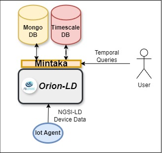

# Historical Data Storage: Orion-LD and Mintaka

## Overview

This directory provides configuration files and deployment examples for the historical data storage layer of the Di-Hydro architecture. It includes the setup for:

- **Orion-LD**, an NGSI-LD-compatible context broker that manages semantically structured data entities.
- **Mintaka**, a time-series backend for persisting temporal data and enabling historical querying.

This component supports the long-term storage and analysis of contextual information generated by Hydro Power Plants (HPPs), enabling functions such as digital twin updates, anomaly detection, and historical trend analysis. While real-time communication is handled through the ComDeX publish/subscribe federation, this layer ensures that context information is durably stored and queryable.


---

## Deployment

### Requirements

- Docker Engine and Docker Compose (tested with Docker ≥ 20.10)
- Minimal host system requirements: 2 GB RAM, 2 CPU cores

### Quick Start

A sample `docker-compose.yml` file is provided in this directory for launching Orion-LD, Mintaka and all their requirements (e.g MongoDB, Timescale DB) in a local setup.

```bash
docker-compose up -d
```

This will start the following services:

- `orion-ld`: Exposes the NGSI-LD API on port `1026`
- `mintaka`: Listens on port `8080` and connects to Orion-LD as its data source
- `timescale`: A time-series database used by Orion-LD to persist temporal entity states.
- `mongo-db`: A MongoDB instance used by Orion-LD for storing non-temporal entity data.

---

## Configuration Notes

- **Orion-LD** must be running and reachable for **Mintaka** to function properly.
- Orion-LD supports the creation and update of NGSI-LD entities, including temporal properties.
- Mintaka requires a **MongoDB** instance as the backend and is configured to automatically persist time-indexed attributes.
- All service configurations (e.g., ports, logging levels) can be adjusted in the `docker-compose.yml` file.

---

## Example Workflow

### Create an entity in Orion-LD

Use `curl` or any NGSI-LD-compatible client to create a structured entity:

```bash
curl -X POST \
  http://localhost:1026/ngsi-ld/v1/entities \
  -H 'Content-Type: application/ld+json' \
  -d @example_entity.json
```

### Query historical data in Mintaka

Once an entity with time-indexed attributes is updated, Mintaka can be queried using NGSI-LD temporal operators.

Example:

```bash
curl -X GET \
  'http://localhost:8080/ngsi-ld/v1/temporal/entities?id=urn:ngsi-ld:Sensor:001&type=Sensor' \
  -H 'Accept: application/ld+json'
```

---

## Integration with Other Components

- **ComDeX** handles real-time dissemination but does not persist data; therefore, Orion-LD + Mintaka are necessary to ensure historical availability.

---

## Documentation

For advanced configuration and setup, refer to:

- [Orion-LD documentation](https://fiware-orion-ld.readthedocs.io)
- [Mintaka documentation](https://github.com/FIWARE/Mintaka)

All components are configured for the needs of the Di-Hydro platform, and adjustments can be made as needed for pilot-specific deployments.