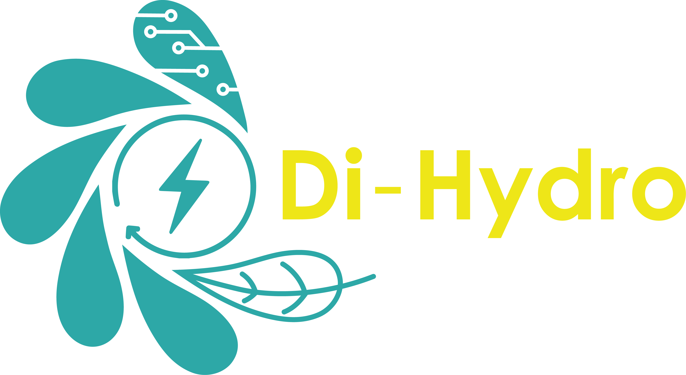
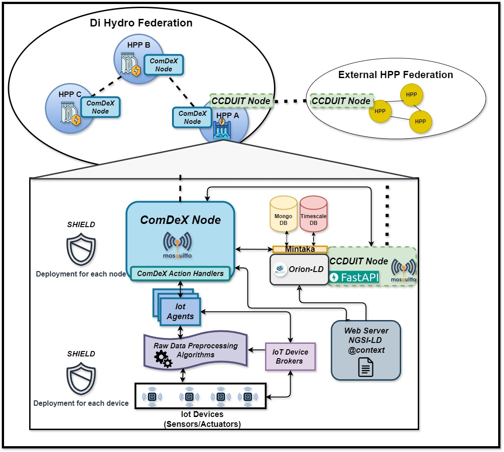

# Secure and Transparent Data Exchange Protocols for Optimizing Hydro Power Plant Operations

## Di-Hydro – Deliverable D2.2: Software Implementation Repository
**Grant Agreement**: No. 101122311 – Horizon Europe

This repository contains the software implementation corresponding to Deliverable D2.2 of the Di-Hydro project. It implements a modular, secure, and semantically interoperable framework for managing operational data within Hydro Power Plants (HPPs), covering the full data lifecycle from sensor acquisition to federated data exchange and secure long-term storage.

All core components of the system are released under open licenses, and each software module is documented with usage examples, configuration files, and test datasets to facilitate reuse and deployment.

## Overview

Deliverable D2.2 accompanies the architectural and technical documentation submitted under the same identifier. This software package includes:

- Preprocessing tools for converting raw sensor signals into structured, cleaned data
- Semantic transformation modules using NGSI-LD representations
- Federated publish/subscribe communication layer (ComDeX)
- Security and trust evaluation mechanisms (SHIELD)
- Cross-federation interoperability middleware (CCDUIT)
- Persistent historical storage via Orion-LD and Mintaka

These components form a complete, reference implementation for secure and transparent data-driven HPP operations.

## System Architecture

The Di-Hydro data management stack is composed of six interoperating layers:

```
+----------------------------------------------------+
|       Federation-to-Federation Communication       |
|                     (CCDUIT)                       |
+----------------------------------------------------+
|     ComDeX Federation (MQTT + NGSI-LD Semantics)   |
+----------------------------------------------------+
|        SHIELD Security Trust Layer (MQTT)          |
+----------------------------------------------------+
|   IoT Agents for Semantic Transformation (NGSI-LD) |
+----------------------------------------------------+
|         Preprocessing Algorithms per Sensor Type   |
+----------------------------------------------------+
|      Raw Sensor Signals from Deployed Devices      |
+----------------------------------------------------+
```



##  Repository Structure

Each top-level folder represents a logical component of the architecture. All components include detailed setup instructions and test scripts.

```
/Data Preprocessing/
│   Sensor-specific signal cleaning and formatting
│   + iot_agents/ - NGSI-LD adapters for structured data
│
/ComDeX/
│   MQTT-based federated context broker and advertisement engine
│
/SHIELD/
│   Attack graph generation, trust evaluation, and mitigation logic
│
/CCDUIT/
│   Middleware for cross-federation semantic and protocol interoperability
│
/Database/
│   Orion-LD and Mintaka integration for long-term context storage
```

##  Deployment and Execution Guide

### 1. Prerequisites

- Please see the prerequisites of each software component in the appropriate directory.

### 2. Preprocessing and IoT Agents

Raw sensor data must first be processed via the modules in `/Preprocessing/`, which includes signal cleaning, parameter extraction (e.g., RMS, AE amplitude), and format normalization.

**Disclaimer**: The IoT Agents provided are functional examples based on the NGSI-LD specification and follow the FIWARE pattern. They are configured for simulated datasets and serve as a reference for the integration of actual devices once fully deployed.

### 3. Real-time Federation (ComDeX)

ComDeX (documented in `/ComdeX/`) enables publish/subscribe messaging over MQTT and supports context advertisement and subscription discovery using NGSI-LD semantics.

- Each HPP node runs a ComDeX broker instance.
- Brokers communicate over a federated overlay (bridged MQTT brokers).
- Data advertisements propagate NGSI-LD metadata to enable topic discovery.


### 4. Security and Trust (SHIELD)

SHIELD (documented in `SHIELD`) protects the federation using attack graph analysis and dynamic trust scoring. Each node computes trust metrics based on:

- Communication topology (reachability)
- CVE vulnerability scans (Nessus/OpenVAS compatible)
- Attack path analysis using CVSS scoring

### 5. Historical Storage

ComDeX focuses on real-time streaming and does not persist messages. Historical storage is handled by:

- **Orion-LD**: Context broker storing NGSI-LD entities
- **Mintaka**: Time-series backend for historical querying

These components are co-deployed per HPP node. Examples and docker-compose templates are provided in `/Database/`.

### 5. Interoperability (CCDUIT)

CCDUIT (documented in `CCDUIT`) serves as an overlay middleware that enables semantic and protocol translation across federated deployments. It:

- Translates NGSI-LD payloads between MQTT and HTTP
- Enforces data-sharing policies across independent HPP infrastructures
- Supports selective exposure of topics and attributes based on context


## Documentation

Each module includes its own `README.md` file, containing setup instructions, usage examples, and technical details

## Licensing

All components in this repository are released under the MIT License, which permits reuse, modification, and redistribution with minimal restriction. The license applies uniformly to the entire repository unless otherwise explicitly stated within a specific subdirectory

## Related Publications

The following publications document core components, design principles, and experimental outcomes of components present in the Di-Hydro data management framework:

- **Nikolaos Papadakis, Georgios Bouloukakis, and Kostas Magoutis.**  
  *ComDeX: A Context-aware Federated Platform for IoT-enhanced Communities.*  
  In *Proceedings of the 17th ACM International Conference on Distributed and Event-based Systems (DEBS '23)*, ACM, 2023, pp. 37–48.  
  [https://doi.org/10.1145/3583678.3596890](https://doi.org/10.1145/3583678.3596890)

- **Nikolaos Papadakis, Georgios Bouloukakis, and Kostas Magoutis.**  
  *Demo: ComDeX Unveiled Demonstrating the Future of IoT-Enhanced Communities.*  
  *DEBS '23*, ACM, 2023, pp. 187–190.  
  [https://doi.org/10.1145/3583678.3603279](https://doi.org/10.1145/3583678.3603279)

- **N. Papadakis, G. Bouloukakis, and K. Magoutis.**  
  *CCDUIT: A Software Overlay for Cross-Federation Collaboration Between Data Spaces.*  
  In *2024 IEEE 21st International Conference on Software Architecture Companion (ICSA-C)*, pp. 143–150.  
  [https://doi.ieeecomputersociety.org/10.1109/ICSA-C63560.2024.00031](https://doi.ieeecomputersociety.org/10.1109/ICSA-C63560.2024.00031)

- **Nikolaos Papadakis, Niemat Khoder, Daphne Tuncer, Kostas Magoutis, Georgios Bouloukakis.**  
  *Adaptive and Interoperable Federated Data Spaces: An Implementation Experience.*  
  *20th International Conference on Software Engineering for Adaptive and Self-Managing Systems (SEAMS 2025)*, Ottawa, Canada.  
  [hal-04936323](https://hal.science/hal-04936323v1/)

- **Alessandro Palma, Nikolaos Papadakis, Georgios Bouloukakis, Joaquin Garcia-Alfaro, Mattia Sospetti, Kostas Magoutis.**  
  *SHIELD: Assessing Security-by-Design in Federated Data Spaces Using Attack Graphs.*  
  In *Proceedings of the 40th ACM/SIGAPP Symposium on Applied Computing (SAC '25)*, ACM, 2025, pp. 480–489.  
  [https://doi.org/10.1145/3672608.3707797](https://doi.org/10.1145/3672608.3707797)

- **Nikolaos Papadakis, Georgios Bouloukakis, and Kostas Magoutis.**  
  *Enabling IoT-enhanced Data Models for Context-aware Hydropower Plants.*  
  In *Proceedings of the 14th International Conference on the Internet of Things (IoT '24)*, ACM, 2025, pp. 108–116.  
  [https://doi.org/10.1145/3703790.3703803](https://doi.org/10.1145/3703790.3703803)
  
## Acknowledgements

This project has received funding from the European Union’s Horizon Europe Research and Innovation Programme under grant agreement No. 101122311.

