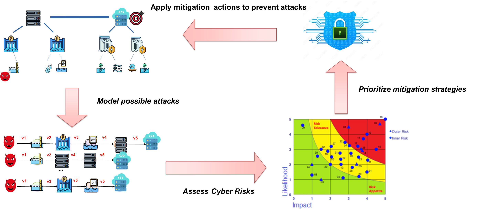

# SHIELD: Security-by-Design in Federated Data Spaces using Attack Graphs

---

## Overview

**SHIELD** (Security by desIgn for fEderated data spaces using attack graphs and trust moDels) is a research prototype that simulates and assesses **cybersecurity risks** in **federated data spaces**, where multiple interconnected systems exchange messages to provide smart services.

Traditional cybersecurity in such environments often focuses on message encryption (e.g., TLS). However, this does not protect against **vulnerabilities in the platform or applications**. SHIELD introduces **attack graphs** and **trust computation** to evaluate system weaknesses proactively and **mitigate risks before they escalate**.

**Overview of SHIELD**

---
## Use Case Scenario: Hydropower Plant

In a hydropower plant environment, various subsystems such as turbines, sensors, control units, dam gates, and remote monitoring systems form a federated network. These components communicate to regulate water flow, energy production, and safety operations. Vulnerabilities in any of these interconnected systems—such as outdated firmware in sensors or unsecured communication channels—can be exploited by attackers to disrupt critical operations like power generation or flood control. SHIELD simulates such environments, assesses potential risks via attack graphs, and proposes trust-based mitigations to safeguard against cascading failures.

SHIELD simulates such networks and:
- Builds attack graphs based on known CVEs
- Calculates trust for each node
- Simulates publish/subscribe messaging
- Evaluates system resilience with and without mitigation

---

##  Goals

- **Proactive cybersecurity assessment**
- **Simulation of attack propagation**
- **Dynamic trust-based message handling**
- **Visualization of risks and trust metrics**

---

## 🗂️ Repository Structure

| Path                     | Description |
|--------------------------|-------------|
| `data/`                  | Network configuration files (`*.json`) with nodes, links, and vulnerabilities. |
| `experiments/`           | Contains output data (`data/`) and plots (`plot/`) generated during simulation. |
| `src/`                   | Core logic for building networks, computing attack graphs, and managing trust. |
| `src/srcEx/`             | MQTT-related scripts to simulate publisher/subscriber communication. |
| `src/srcEx/config/`      | Mosquitto broker configuration (`broker.conf`). |
| `requirements.txt`       | Python dependencies list. |
| `README.md`              | Main documentation file. |

---

## ⚙️ Installation Instructions

### 1. Install System Dependencies

- **Python 3.8+**
- **Docker**
- **Mosquitto MQTT Broker**

```bash
sudo apt update -y 
sudo apt install python3-pip docker.io mosquitto mosquitto-clients -y
```

### 2. Install Python Dependencies

```bash
sudo pip3 install -r requirements.txt
```

---

## How It Works

### Core Concepts

- **Attack Graphs**: Nodes represent system components and edges represent possible attack paths. SHIELD uses `networkx` to generate these graphs based on known vulnerabilities (CVEs).
- **Trust Model**: Each node has a trust value based on past behavior and vulnerability exposure.
- **Simulation**: Publish/subscribe messages are sent using MQTT. SHIELD simulates both secure and insecure scenarios.

---

## Step-by-Step Usage

### Step 1: Configure Mosquitto (MQTT Broker)

1. Create directory for config:
```bash
sudo mkdir -p /etc/mosquitto/<your_folder>
```

2. Copy the config file:
```bash
cp src/srcEx/config/broker.conf /etc/mosquitto/<your_folder>/broker.conf
```

3. Run Dockerized Broker:
```bash
sudo docker network create -d bridge mqttNetwork
sudo docker pull eclipse-mosquitto

sudo docker run -it -d --name broker -p 1883:1883   --network mqttNetwork   -v /etc/mosquitto/<your_folder>/broker.conf:/mosquitto/config/mosquitto.conf   eclipse-mosquitto
```

---

### Step 2: Launch the Simulation

#### Terminal 1 – Subscriber
```bash
cd src/srcEx
sudo python3 buildNet.py
```

> This script launches subscriber clients that listen to MQTT topics. It models the network described in `data/`.

#### Terminal 2 – Publisher
```bash
sudo python3 src/main.py
```

> This script builds the attack graph, computes trust scores, simulates attacks, and publishes messages.

---

## 🧾 Explanation of Key Files

### `data/v2x_network.json`
Defines the network topology and node vulnerabilities. Structure:
```json
{
  "nodes": [{"id": "Vehicle1", "cve": ["CVE-2020-12345"]}, ...],
  "edges": [{"source": "Vehicle1", "target": "RSU1"}]
}
```

### `src/main.py`
Main orchestrator script. It:
- Loads the network
- Builds the attack graph (`attack_graph.py`)
- Computes node risk levels and trust scores
- Applies mitigation logic via mitigation.py
- Triggers the simulation and generates results

### `attack_graph.py`
Constructs a directed attack graph using known vulnerabilities (e.g., CVEs). Nodes represent devices or components, and edges represent potential paths an attacker can exploit. It computes metrics like the shortest attack paths and exposure levels.

### `mitigation.py`
Analyzes the attack graph and trust values to determine which nodes pose significant risk. Implements a mitigation strategy by:

    Reducing trust scores of vulnerable or high-risk nodes

    Marking such nodes to be excluded or down-prioritized during message handling

    Supporting risk-aware message control (not literal message rerouting)

### `analysis_experiments.py`
Performs analysis of the simulation outputs, including:

    Generating plots (e.g., risk trends, response time, trust evolution)

    Evaluating system performance under attack and mitigation scenarios

---

## 📊 Output

Check the following after a run:

### In `experiments/plot/`:
- `risk.png` – Risk level per node
- `community_matrix.png` – Trust-based communication matrix
- `confusion_m.png` – Performance of trust predictions
- `response_time.png`, `agtime.png` – Time metrics

### In `experiments/data/`:
- CSV/JSON files with numeric results and trust values

---

##  Customization

To define your own network:
1. Copy an existing JSON file in `data/`
2. Modify node list, links, and attach known CVEs
3. Run the simulation again using the new file

---

## 🛠 Troubleshooting

- **Port already in use**: Run `lsof -i :1883` and kill conflicting process.
- **No plots or data**: Ensure subscriber terminal is active **before** publisher.
- **Permission issues**: Run Python and Docker commands with `sudo`.


## Acknowledgements

This project is supported by:
- Horizon Europe DI-Hydro (Grant #101122311)
- Sapienza AR Grant AR2241902B426269
- Horizon 2020 MSCA (Grant #10100782)

---
